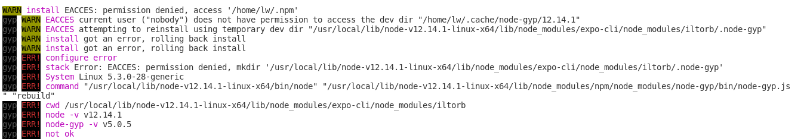

#  多源手机信息采集平台(FinalDesign)  

多源手机信息采集平台是一款能够使用移动设备进行传感器信息采集、分析和可视化的软件。

* **数据丰富：** 利用手机平台的传感器的多样性和可移动性，可以方便的在不同时间与空间进行大量的数据收集。可采集的数据有：[大气温度](https://developer.android.google.cn/reference/android/hardware/Sensor.html#TYPE_AMBIENT_TEMPERATURE)、[重力](https://developer.android.google.cn/reference/android/hardware/Sensor.html#TYPE_GRAVITY)、[环境地磁场](https://developer.android.google.cn/reference/android/hardware/Sensor.html#TYPE_MAGNETIC_FIELD)、[气压](https://developer.android.google.cn/reference/android/hardware/Sensor.html#TYPE_PRESSURE)、[相对湿度](https://developer.android.google.cn/reference/android/hardware/Sensor.html#TYPE_RELATIVE_HUMIDITY)、[设备温度](https://developer.android.google.cn/reference/android/hardware/Sensor.html#TYPE_TEMPERATURE)，详细传感器信息请访问[这个链接](https://developer.android.google.cn/guide/topics/sensors/sensors_overview)。

* **多平台适应：** 本平台采用[ReactNative(v0.6.1)](https://reactnative.cn/)进行手机端的程序编写，React Native允许我们使用[TypeScript(v3.7)](https://www.typescriptlang.org/)语言进行多端原生UI组件的编写，与此同时还可以使用Native Module 进行手动封装模块代码。后端采用了Express + nodejs 框架对服务进行处理。

* **数据可视化：** 将采集到的数据上传到服务器，并采用特殊算法进行处理加工（也会保存原始数据）。并将采集到的数据加工出来。

* **可扩展性：** 本平台预先开发了一套应用处理接口，方便开发者后续扩展功能。

## 功能框架
### 手机端

### 服务器端

## 接口定义

## 随笔
本项目是一个毕业设计项目，也是我的第一个React-Native 项目。其中的内容难免会有些错误，欢迎大家提Issue，我也会认真的完成这个项目的。觉得还不错的话欢迎Star，本人博客地址：[一只小白喵的进阶之路](https://lovelywhite.cn/)。

## 版权声明
本软件遵循GNUv3开源协议。

## 踩坑记录
1. expo-cli 安装的时候出错

* 错误内容：npm ERR! Error: EACCES: permission denied, access

* 错误原因：因为要导入sensors包，expo install expo-sensors，所以需要安装expo-cli。安装expocli的时候出现这种错误。
* 解决方法：sudo npm install --unsafe-perm=true --allow-root ([链接](https://blog.csdn.net/testcs_dn/article/details/78869419))

2. react-navigation-tabs 切换闪一下白屏
## 参考文献
